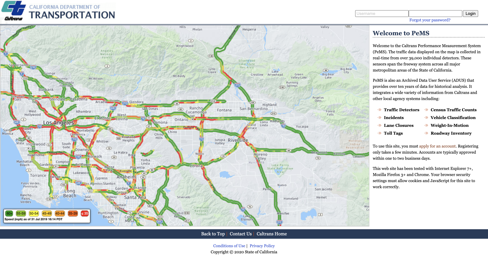
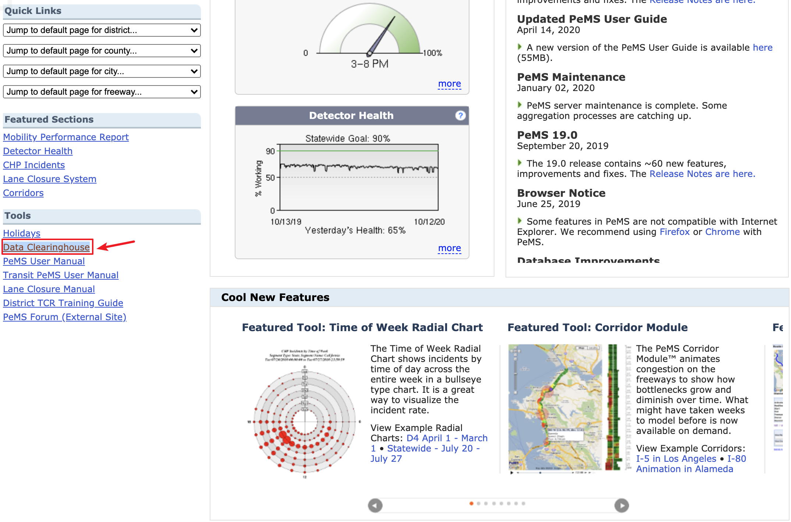
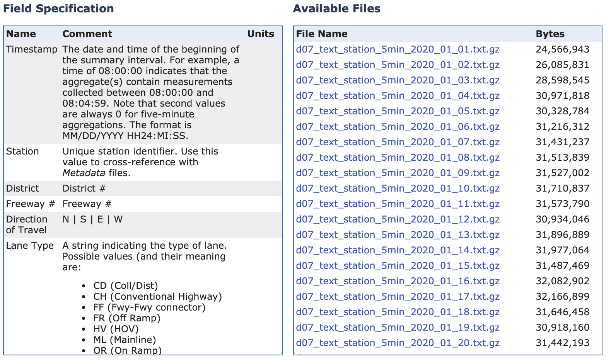
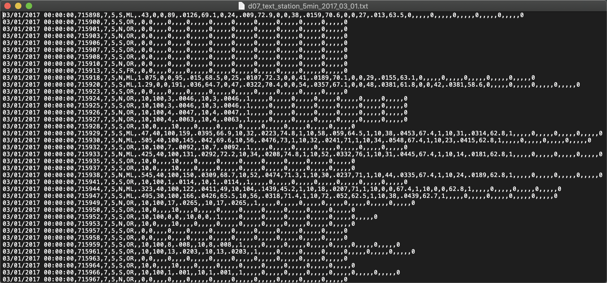

# PeMS数据集

[PeMS](http://pems.dot.ca.gov/)(需科学上网)数据集是由美国加州高速公路性能测量系统(Performance Measurement System)所收集并汇总得到的数据，是交通领域使用非常广泛的一个数据集，但是现在缺少一个较为完整的教程来帮助大家获取原始数据和自己所需要的信息，本篇文章的目的就是要解决这个问题。

## 介绍

PeMS数据集提供了加州高速公路的各种监测数据，包括路况信息，车辆平均行速度，交通事故等。通过对得到的时空数据进行挖掘，并建立适当的模型对交通状况进行预测，可以解决城市计算中的许多问题。

## 下载

下面我们通过例子演示如何下载PeMS数据集。

1. 首先注册并登陆PeMS官网
2. 向下滑动页面，在页面左下角找到[Data Clearinghouse](http://pems.dot.ca.gov/?dnode=Clearinghouse)

3. 进入Clearinghouse主界面后，在上方输入对应的Type和District。

PeMS系统上提供了多种数据集，一般我们使用Type为Station 5-Minute，对应的District选择需要的街区即可，比如我想要下载District 7的数据就进行下面的操作。

点击提交按钮后会在Available Files提供对应的数据集，默认提供最新的数据，左侧Field Specification提供了数据每列的详细解释。

如果我们想要获取之前的历史数据，需要选择对应的日期，例如想要下载2017年3月份的数据。

点击对应的灰色按钮后，下方的Available Files会提供你需要的数据，点击即可下载。

4. 解压下载的压缩包，观察数据

纯手动下载较为麻烦，这里提供一个[爬虫项目]()(待完善)来爬去对应的数据。

## 数据处理

## 模型训练

## 参考

[1] [PeMS_intro_User_Guide](https://github.com/Knowledge-Precipitation-Tribe/Urban-computing-papers/blob/master/pdf/PeMS_Intro_User_Guide_v6.pdf)

